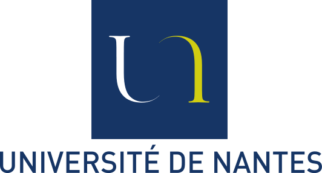

<!-- PROJECT SHIELDS -->
<!--
*** I'm using markdown "reference style" links for readability.
*** Reference links are enclosed in brackets [ ] instead of parentheses ( ).
*** See the bottom of this document for the declaration of the reference variables
*** for contributors-url, forks-url, etc. This is an optional, concise syntax you may use.
*** https://www.markdownguide.org/basic-syntax/#reference-style-links
-->
[![LinkedIn CA][linkedin-shield]][linkedin-url-1]
[![LinkedIn CAJ][linkedin-shield]][linkedin-url-2]

<!-- PROJECT LOGO -->
 

  

  <h3 align="center">AGAR Report (M2 datascience)</h3>

  

    Clément Antheaume - Camille-Amaury Juge
          
  

<!-- TABLE OF CONTENTS -->
## Table of Contents

* [About the Project](#about-the-project)
  * [Built With](#built-with)
* [Content](#content)
* [License](#license)
* [Contact](#contact)

<!-- ABOUT THE PROJECT -->
## About The Project

Here is a project following Classification and Representation Learning we did during the second master degree year of datascience in Nantes' University.
Read the pdf report about the project to know more about it.

### Built With

* [Python 3.7](https://www.python.org/)
* [Anaconda](https://www.anaconda.com/)
* [Jupyter Notebook](https://jupyter.org/)
* [Google Colab](https://colab.research.google.com/)

Here is a list of the Python library we used :

* [Pandas](https://pandas.pydata.org/)
* [Numpy](https://numpy.org/)
* [Matplotlib](https://matplotlib.org/)
* [Seaborn](https://seaborn.pydata.org/)
* [Plotly](https://plot.ly/)
* [Pulp](https://pypi.org/project/PuLP/)

<!-- LICENSE -->
## License

You can freely copy notebooks except for pdf files which belongs to the Nantes' University.

<!-- CONTACT -->
## Contact

See the linkedIn shields in the top of the README.md

<!-- MARKDOWN LINKS & IMAGES -->
[linkedin-shield]: https://img.shields.io/badge/-LinkedIn-black.svg?style=flat-square&logo=linkedin&colorB=555
[linkedin-url-1]: https://www.linkedin.com/in/cl%C3%A9ment-antheaume-9266a1171/
[linkedin-url-2]: https://www.linkedin.com/in/camille-amaury-juge/
